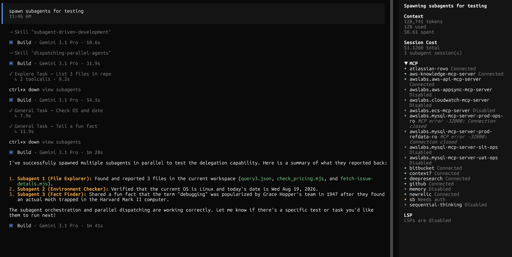

# opencode-session-cost

An [OpenCode](https://opencode.ai) TUI plugin that always shows, in the
sidebar, the total cost of the active session plus all of its subagent
(`task` tool) sessions — using only OpenCode's own locally tracked
`session.cost`. No gateway, no provider-specific integration, no network
calls beyond the local OpenCode server the TUI already talks to.



## What it does

- Walks the active session's `parentID` chain to find the root session.
- Recursively sums `session.cost` across the root and every descendant
  session reachable via `parentID` — i.e. every `task` tool dispatch in the
  session tree, at any depth.
- Renders a "Session Cost" block in the sidebar, directly below the
  built-in Context block, showing the total cost and (when non-zero) the
  number of subagent sessions.
- Works with any provider/gateway, since cost comes entirely from
  OpenCode's own tracked data — no external API calls, no correlation
  headers, nothing gateway-specific.

## Installation

This is a **TUI-only** plugin. It has no server-side hook and must be added
to `tui.json`, not `opencode.json`:

```json
{
  "plugin": [
    ["/absolute/path/to/opencode-session-cost", { "enabled": true }]
  ]
}
```

Or, once published to npm:

```json
{
  "plugin": [["opencode-session-cost", { "enabled": true }]]
}
```

Restart the OpenCode TUI after editing `tui.json`.

### Options

| Option    | Type    | Default | Description                                                          |
| --------- | ------- | ------- | ---------------------------------------------------------------------|
| `enabled` | boolean | `true`  | When `false`, the plugin's `tui()` returns immediately and registers nothing. |

There is no provider allow-list and no other configuration — this works
for every session regardless of model or provider.

## How refresh works

The sidebar recomputes on session lifecycle events —
`session.idle`, `session.updated`, and `session.created` — with no polling
loop. Each event bumps an internal refresh token that forces the cost
subtree to be recomputed, even when the resolved root session itself
hasn't changed.

On a fetch error (e.g. `client.session.children` rejecting for one node),
the view keeps the last successfully computed total and appends a muted
"(stale)" indicator rather than crashing the sidebar.

## What "subagent session(s)" counts

Every session reachable from the root via `parentID`, i.e. every `task`
tool dispatch anywhere in the session tree, at any depth — not just direct
children of the currently active session.

## Relationship to `opencode-session-correlation`

None. `opencode-session-cost` is fully independent of
[`opencode-session-correlation`](https://github.com/igorvelho/opencode-session-correlation) —
no shared imports, no shared config, no runtime dependency in either
direction. The two packages can be installed together or separately.

## Architecture

- `src/cost.ts` — pure, framework-free cost aggregation logic
  (`resolveRoot`, `subtreeCost`), unit-tested with `bun:test` against a
  fake minimal API surface. No `@opentui`/Solid/JSX imports.
- `src/tui.tsx` — the `TuiPlugin` entrypoint: registers the
  `sidebar_content` slot and renders a small Solid view that consumes
  `src/cost.ts`'s pure functions via the live `TuiPluginApi`.
- `scripts/build.ts` — builds `src/tui.tsx` with `Bun.build` and
  `@opentui/solid/bun-plugin` (plain `tsc` cannot compile Solid JSX; it only
  type-checks it, which is what `bun run typecheck` uses).

## Development

```bash
bun install
bun run typecheck   # tsc --noEmit
bun test            # bun:test, pure logic in src/cost.test.ts
bun run build        # Bun.build (JSX) + tsc --emitDeclarationOnly (types)
```

## License

MIT
